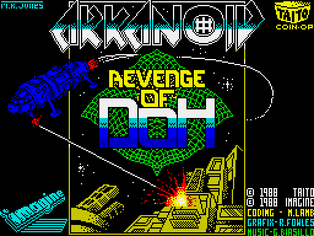
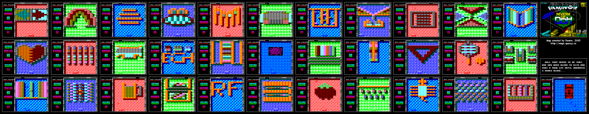
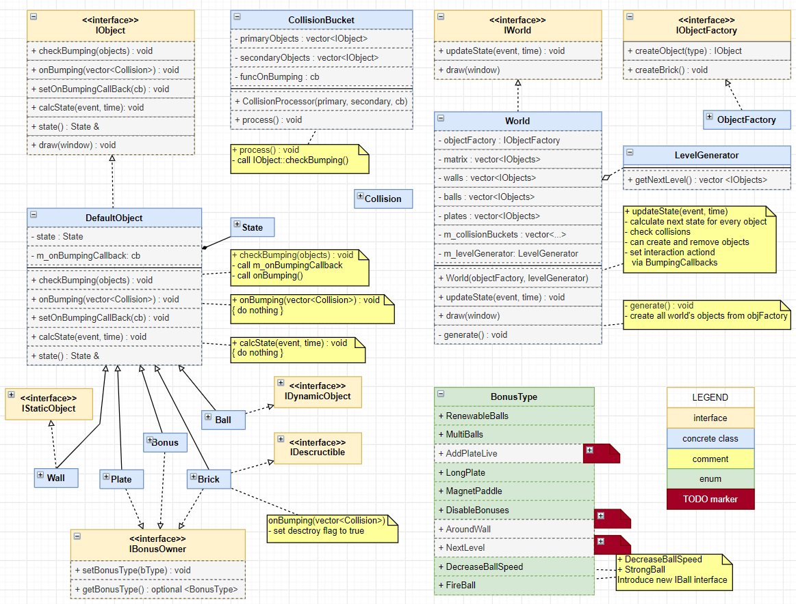
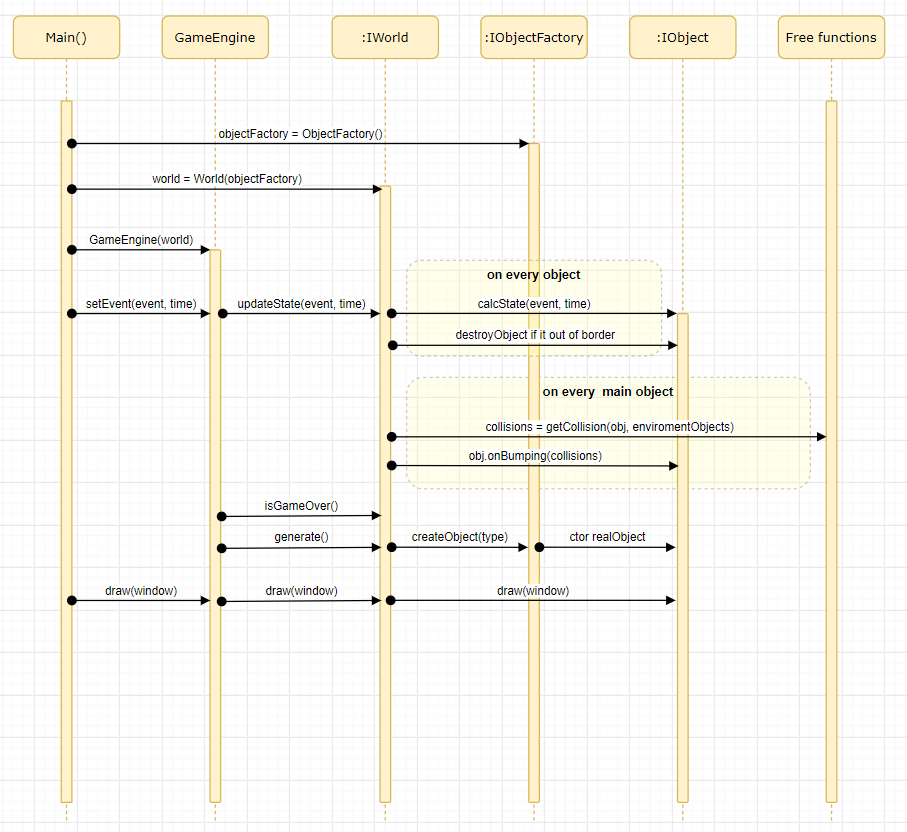

# Arkanoid

Watch the game video here: [Gameplay Video](https://youtu.be/5E_FN0p6SUk)

## Idea

The goal is to create a replica of the original Arkanoid game from the ZX Spectrum:

## Original Levels from ZX Spectrum

Not all levels are implemented yet. The order of the levels is random.

## Important Notes

- Start the application from the **root working directory**, not from the `bin` directory. This is necessary to find the configuration file with relative paths in the code. Use the shortcut from the start menu - it should work correctly.
- The project is built for Windows (VS 2017) using CMAKE. Refer to the `build_installer.cmd` script for an example. The source code uses hardcoded font names, which should be fixed to prevent runtime errors on other OS. The project has not been built for other OS yet.

## Level Editor

To edit levels, modify the `config/config.txt` file. Use the original version as an example. The file consists of a list of matrices separated by empty lines. Every line in a matrix should have the same symbol length. Here is a list of available symbols to construct levels (DO NOT USE OTHER SYMBOLS - it leads to errors):

- `.` - empty brick (DO NOT USE ` ` "space" symbol to create empty spaces)
- `0` - immortal brick
- `1..9` - usual brick with lives
- `R` - RenewableBalls
- `M` - MultiBalls
- `A` - AddPlateLive (coming soon)
- `L` - LongPlate
- `G` - MagnetPaddle
- `D` - DisableBonuses
- `W` - AroundWall (coming soon)
- `N` - NextLevel (coming soon)
- `S` - DecreaseBallSpeed
- `F` - FireBall

## UML Diagrams

Note: Diagrams may not be up-to-date with the current source code.

## History

- 2019-11-23: The original version was introduced. It took 2 weeks from the idea to the first working version.
- 2024-01-27: Arkanoid moved to this repository. Some refactoring was done.
