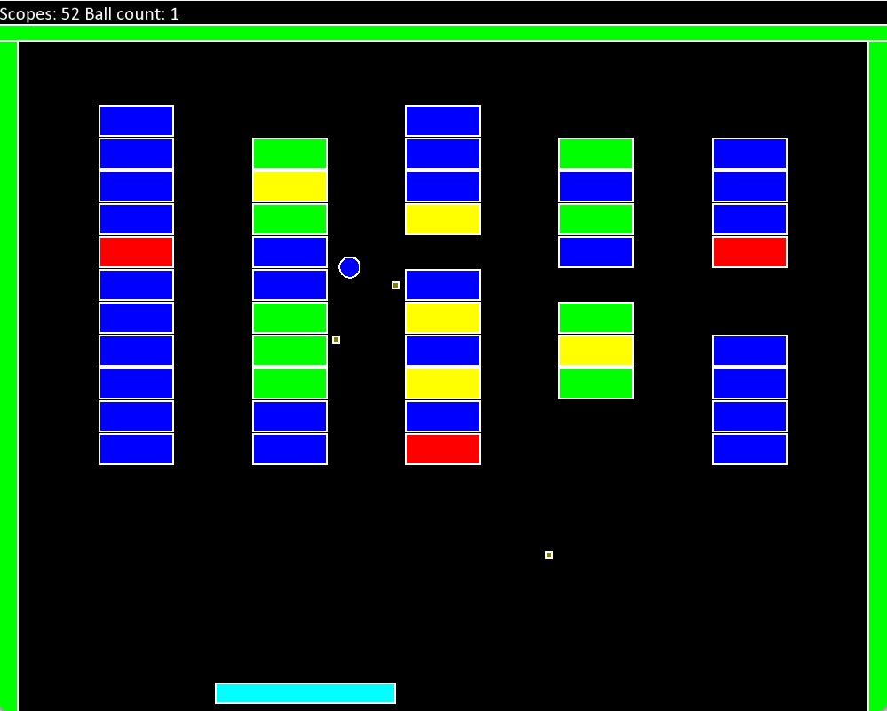
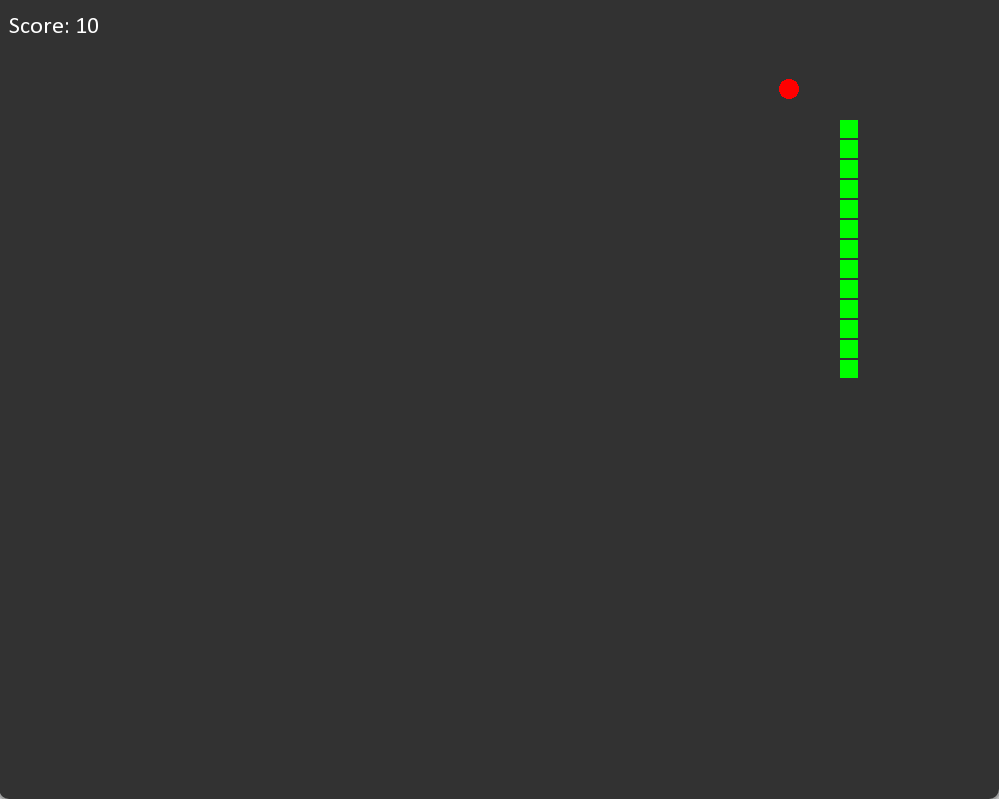

# Cpp Games

## Arkanoid



## Snake



## Pre-requisites

1. CMake
2. vcpkg
3. Visual Studio

Next libraries should be installed in your system. It is recommended to use vcpkg, because it contains all necessary libraries for this project.

```bash
vcpkg install gtest imgui sfml imgui-sfml spdlog nlohmann-json glm magic-enum
```
