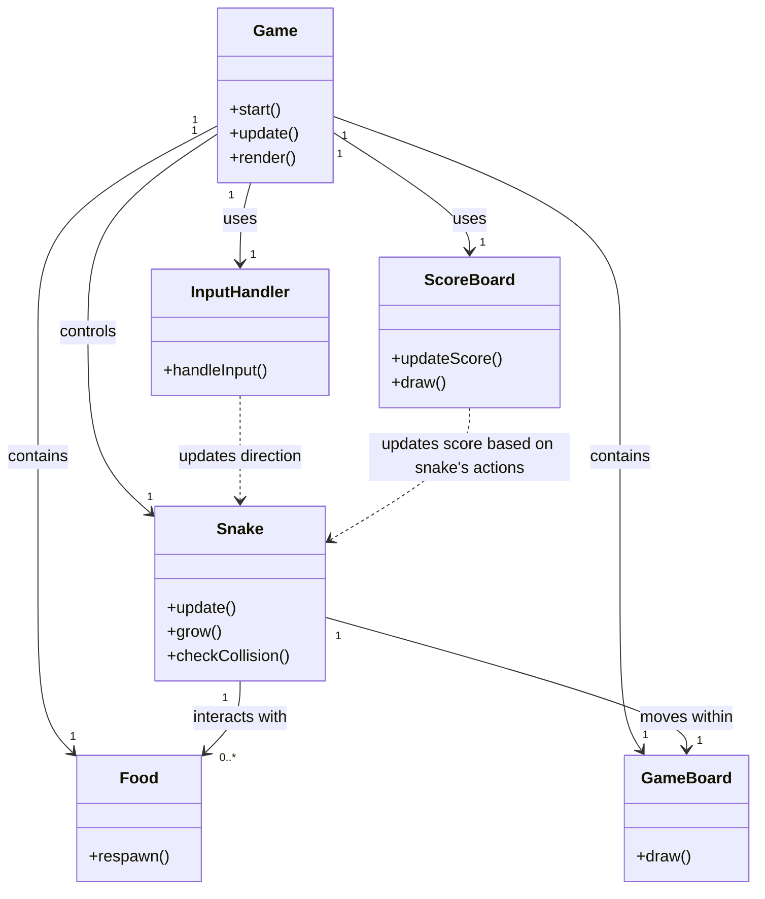

# Snake Game : 2024-01-27, 4h

- `Game`: The main class of the game, it manages the game loop and coordinates interactions between other components.
- `Snake`: This class represents the snake and contains the logic for movement, growth, and collision detection.
- `Food`: A class representing the snake's food, responsible for appearing in random locations on the game field.
- `GameBoard`: A class responsible for rendering the game field.
- `InputHandler`: A class for handling user input and managing the direction of the snake's movement.
- `ScoreBoard`: A class for displaying and updating the game's score.
