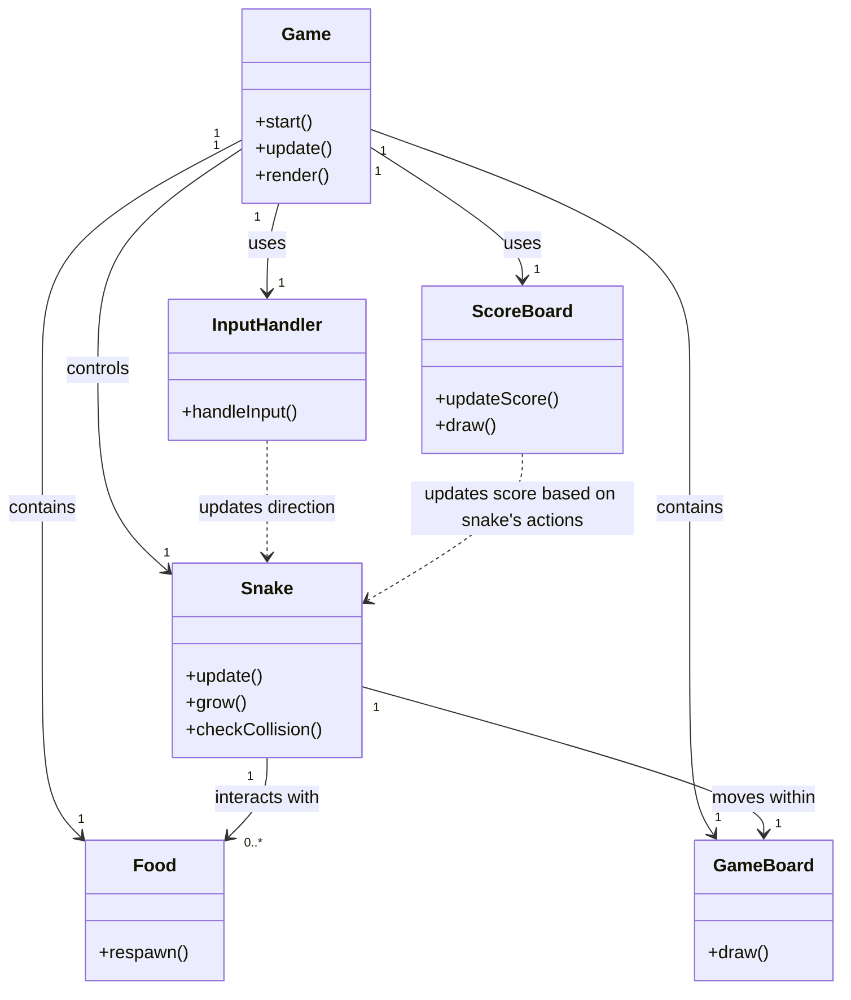

```mermaid
classDiagram
    class Game {
        +start()
        +update()
        +render()
    }
    class Snake {
        +update()
        +grow()
        +checkCollision()
    }
    class Food {
        +respawn()
    }
    class GameBoard {
        +draw()
    }
    class InputHandler {
        +handleInput()
    }
    class ScoreBoard {
        +updateScore()
        +draw()
    }

    Game "1" --> "1" Snake : controls
    Game "1" --> "1" Food : contains
    Game "1" --> "1" GameBoard : contains
    Game "1" --> "1" InputHandler : uses
    Game "1" --> "1" ScoreBoard : uses
    Snake "1" --> "0..*" Food : interacts with
    Snake "1" --> "1" GameBoard : moves within
    InputHandler ..> Snake : updates direction
    ScoreBoard ..> Snake : updates score based on snake's actions

```
